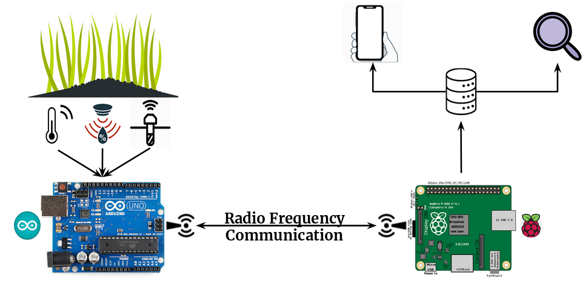
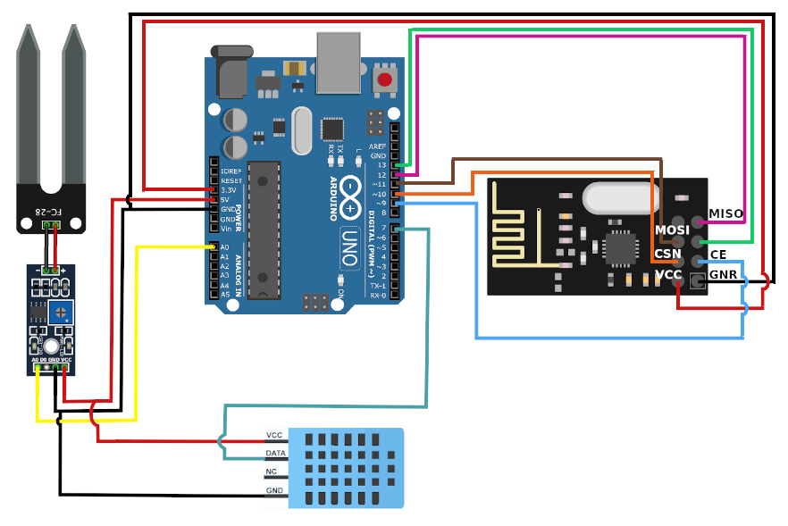
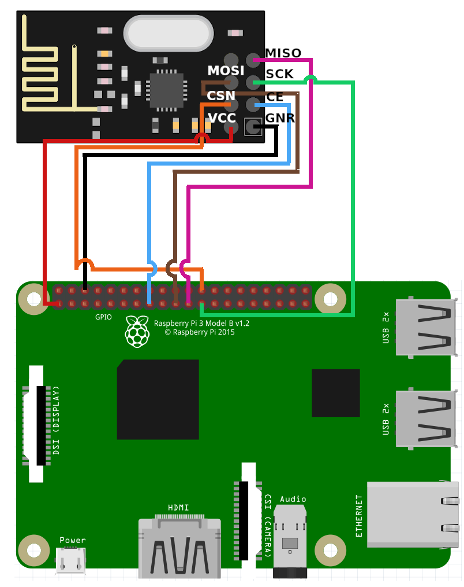

# Argriculture Of Things

> Subtitle or Short Description Goes Here

> include terms/tags that can be searched
---

## Hardware

- 1 x Raspberry Pi 3 model B+
- 1 x Arduino Uno Rev3
- 2 x nRF27l01+
- 1 x Soil Moisture Capacitive Sensor
- 1 x DHT11
---

## What software you need for this project
- Arduino
  - Arduino IDE
  - <a href="https://tmrh20.github.io/RF24/">NRF24L01+</a> Library
- Raspberry Pi
  - Rasbian OS
  - <a href="https://tmrh20.github.io/RF24/">NRF24L01+</a> Library
  - NodeJS
  - Npm
- Machine Learning
  - 1
  - 2
- Android Application
  - Android Studio
---

## Clone
- Clone this repo to your local machine using `git clone https://github.com/open-aot/AgricultureOfThings`

## Installation

### Arduino
- Arduino-Sensors Pins Layout


- Load Code to the board and start Transmitting
  - Open Arduino IDE
  - Open `Tools->Manage Libraries` and install the `RF24 by TMRh20` lirbary
  - Load the code from the file: `./arduino/transmitter.ino` to the Arduino

### Raspberry Pi

#### Receiver
- Raspberry-nRF27l01+ Pins Layout


- Install the Library
> Download and install the RF24 library
```shell
$ git clone https://github.com/nRF24/RF24
$ cd ~/Downloads/RF24/
$ ./configure
$ make
```

- Start Receiving
> Compile and run the receiver.cpp
```shell
$ cd <this repo path>/raspberry-pi/rf24-receiver/
$ g++ receiver.cpp -o receiver -L/home/pi/Downloads/RF24 -lrf24
$ ./receiver & 
```
##### Server

### Machine Learning

### Android Application


- All the `code` required to get started
- Images of what it should look like
- If you want more syntax highlighting, format your code like this:

> update and install this package first

```shell
$ brew update
$ brew install fvcproductions
```

> now install npm and bower packages

```shell
$ npm install
$ bower install
```

## License

[](http://badges.mit-license.org)

- **[MIT license](http://opensource.org/licenses/mit-license.php)**
- Copyright 2015 © <a href="http://fvcproductions.com" target="_blank">FVCproductions</a>.


## Example (Optional)

```javascript
// code away!

let generateProject = project => {
  let code = [];
  for (let js = 0; js < project.length; js++) {
    code.push(js);
  }
};
```
---
## Table of Contents (Optional)

- [Installation](#installation)
- [Features](#features)
- [Contributing](#contributing)
- [Team](#team)
- [FAQ](#faq)
- [Support](#support)
- [License](#license)
---

## Features
## Usage (Optional)
## Documentation (Optional)
## Tests (Optional)

- Going into more detail on code and technologies used
- I utilized this nifty <a href="https://github.com/adam-p/markdown-here/wiki/Markdown-Cheatsheet" target="_blank">Markdown Cheatsheet</a> for this sample `README`.

---

## Contributing

> To get started...

### Step 1

- **Option 1**
    - 🍴 Fork this repo!

- **Option 2**
    - 👯 Clone this repo to your local machine using `https://github.com/joanaz/HireDot2.git`

### Step 2

- **HACK AWAY!** 🔨🔨🔨

### Step 3

- 🔃 Create a new pull request using <a href="https://github.com/joanaz/HireDot2/compare/" target="_blank">`https://github.com/joanaz/HireDot2/compare/`</a>.

---

## Team

> Or Contributors/People

| <a href="http://fvcproductions.com" target="_blank">**FVCproductions**</a> | <a href="http://fvcproductions.com" target="_blank">**FVCproductions**</a> | <a href="http://fvcproductions.com" target="_blank">**FVCproductions**</a> |
| :---: |:---:| :---:|
| [](http://fvcproductions.com)    | [](http://fvcproductions.com) | [](http://fvcproductions.com)  |
| <a href="http://github.com/fvcproductions" target="_blank">`github.com/fvcproductions`</a> | <a href="http://github.com/fvcproductions" target="_blank">`github.com/fvcproductions`</a> | <a href="http://github.com/fvcproductions" target="_blank">`github.com/fvcproductions`</a> |

- You can just grab their GitHub profile image URL
- You should probably resize their picture using `?s=200` at the end of the image URL.

---

## FAQ

- **How do I do *specifically* so and so?**
    - No problem! Just do this.

---

## Support

Reach out to me at one of the following places!

- Website at <a href="http://fvcproductions.com" target="_blank">`fvcproductions.com`</a>
- Twitter at <a href="http://twitter.com/fvcproductions" target="_blank">`@fvcproductions`</a>
- Insert more social links here.

---

## Donations (Optional)

- You could include a <a href="https://cdn.rawgit.com/gratipay/gratipay-badge/2.3.0/dist/gratipay.png" target="_blank">Gratipay</a> link as well.

[](https://gratipay.com/fvcproductions/)


---
