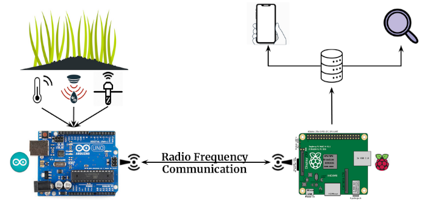

# Argriculture Of Things

> Subtitle or Short Description Goes Here

> include terms/tags that can be searched
---

## Hardware

- 1 x Raspberry Pi 3 model B+
- 1 x Arduino Uno Rev3
- 2 x nRF27l01+
- 1 x Soil Moisture Capacitive Sensor
- 1 x DHT11
---

## What software you need for this project
- Arduino
  - <a href="https://www.arduino.cc/en/main/software">Arduino IDE</a>
  - <a href="https://tmrh20.github.io/RF24/">NRF24L01+</a> Library
- Raspberry Pi
  - <a href="https://www.raspberrypi.org/downloads/raspbian/">Rasbian OS</a>
  - <a href="https://tmrh20.github.io/RF24/">NRF24L01+</a> Library
  - <a href="https://www.instructables.com/id/Install-Nodejs-and-Npm-on-Raspberry-Pi/">NodeJS & Npm</a>
- Android Application
  - <a href="https://developer.android.com/studio">Android Studio</a>
---

## Clone
- Clone this repo to your local machine using `git clone https://github.com/open-aot/AgricultureOfThings`

## Installation

### Arduino
- Arduino-Sensors Pins Layout


- Load Code to the board and start Transmitting
  - Open Arduino IDE
  - Open `Tools->Manage Libraries` and install the `RF24 by TMRh20` lirbary
  - Load the code from the file: `./arduino/transmitter.ino` to the Arduino

### Raspberry Pi

#### Receiver
- Raspberry-nRF27l01+ Pins Layout


- Install the Library
> Download and install the RF24 library
```shell
$ git clone https://github.com/nRF24/RF24
$ cd ~/Downloads/RF24/
$ ./configure
$ make
```

- Start Receiving
> Compile and run the receiver.cpp
```shell
$ cd <this repo path>/raspberry-pi/rf24-receiver/
$ g++ receiver.cpp -o receiver -L/home/pi/Downloads/RF24 -lrf24
$ ./receiver & 
```
##### Server
Use your raspberry pi as server in your local network for the android application.
> Serve the data that received from the Arduino.
```shell
$ cd <this repo path>/raspberry-pi/android-app-server/
$ npm start 
```

### Android Application
- Open Android Studio
- Select `Import project (Gradle, Eclipse ADT, etc.)`
- Naviage to the folder `<this repo path>/android-app` and select `OpenAgriculture`
- Change `SERVER_LOCAL_IP` in the files bellow to your server's IP

./app/src/main/java/com/example/openagriculture/<a href="./android-app/OpenAgriculture/app/src/main/java/com/example/openagriculture/OApiService.kt">OApiService.kt</a>
```kotlin
private const val BASE_URL = "<SERVER_LOCAL_IP>";
```
./app/src/main/res/xml/<a href="./android-app/OpenAgriculture/app/src/main/res/xml/network_security_config.xml">network_security_config.xml</a>
```xml
<domain-config cleartextTrafficPermitted="true">
    <domain includeSubdomains="true">SERVER_LOCAL_IP</domain>
</domain-config>
```
- Follow this <a href="https://developer.android.com/training/basics/firstapp/running-app?fbclid=IwAR3sIRCFqDwvYPwYhAhBavq_VIFlHwuWzofZ9Ty5DmZbMAXllioKPjQN_Yc">tutorial</a> to run the Application on a real device.

## License

[](http://badges.mit-license.org)

- **[MIT license](http://opensource.org/licenses/mit-license.php)**

---
